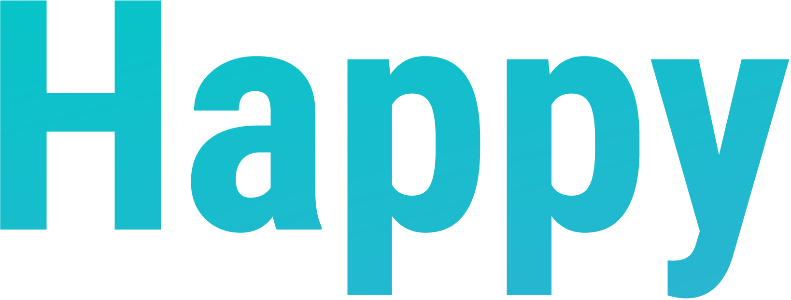
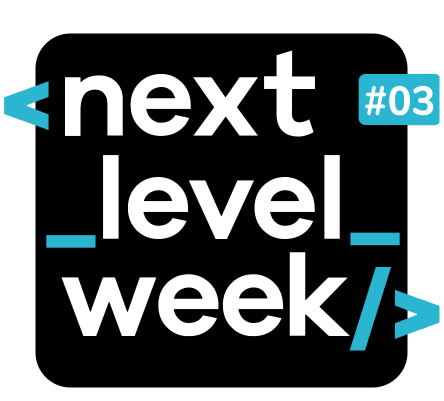
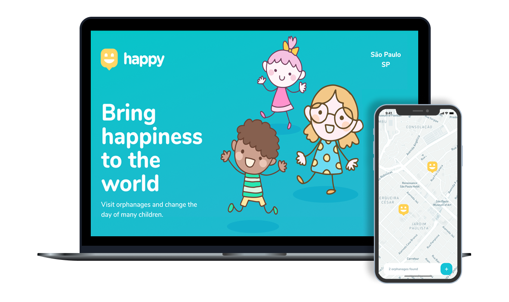

<h1 align="center">
   
    <br>Next Level Week <br/>
    
    <br>
    Node.js | ReactJS | React Native
</h1>

<p align="center">
  
  
   
  <br/>
<a href="https://app.getpostman.com/run-collection/1405a12da0a18e02c9ec" target="_blank"></a>
</p>
<p align="center">
  <a href="#bookmark-about">About</a>&nbsp;&nbsp;&nbsp;|&nbsp;&nbsp;&nbsp;
  <a href="#construction_worker-structure">Project Structure</a>&nbsp;&nbsp;&nbsp;|&nbsp;&nbsp;&nbsp;
  <a href="#rocket-technology">Technologies</a>&nbsp;&nbsp;&nbsp;|&nbsp;&nbsp;&nbsp;
  <a href="#boom-how-to-run">How to run</a>&nbsp;&nbsp;&nbsp;|&nbsp;&nbsp;&nbsp;
  <a href="#memo-license">License</a>
</p>

<p align="center">
  
<p>

## :bookmark: About

**Happy** is a web and mobile app designed to help connect people to orphanages. This application offers people the possibility to register new orphanages so that they can be visited. With that, people can help those most in need.
  
This project was developed with the educational purpose all orphanages elaborated in this example are fictitious.


  
This application made was during the Next **Level Week #3**, project made by [Rocketseat](https://rocketseat.com.br/).

## :construction_worker: Structure


**Structure Mobile**

[](https://www.figma.com/file/fW7U2qwmWEE9z2W3PWSe2P/Happy-Mobile-Structure?node-id=0%3A1)

**Structure Web**

[](https://www.figma.com/file/IEhULmrNpX8PoWEZvckZmc/Happy-Web-Structure)
## :rocket: Technology

-  [Typescript](https://www.typescriptlang.org/)
-  [Node.js](https://nodejs.org/en/)
-  [ReactJS](https://reactjs.org/)
-  [React Native](http://facebook.github.io/react-native/)
-  [Expo](https://expo.io/)
-  [Express](https://expressjs.com/)
-  [axios](https://github.com/axios/axios)

## :boom: How to run

- ### **Prerequisites**

  - It's **necessary** to have **[Node.js](https://nodejs.org/en/)** installed on the computer
  - It's  **necessary** to have  **[Git](https://git-scm.com/)** installed and configured on the computer
  - It's also **need** have a package manager be the **[NPM](https://www.npmjs.com/)** or **[Yarn](https://yarnpkg.com/)**.
  - Lastly, It's **necessary** to have **[Expo](https://expo.io/)** globally installed on the machine

1. Clone the repository:

```sh
  $ git clone https://github.com/engineercivil/Happy.git
```

2. Running the Application:

```sh
  # API
  $ cd server
  # Installing the project dependencies.
  $ yarn # ou npm install
  # Setting up the database and creating the tables.
  $ yarn knex:migrate # ou npm run knex:migrate

  # Start the API
  $ yarn dev

  # Web application
  $ cd web
  # Installing the project dependencies.
  $ yarn or npm install
  # Launch the web application
  $ yarn start or npm start

  # Mobile application
  $ cd mobile
  # Installing the project dependencies.
  $ yarn # or npm install
  # Launch the mobile application
  $ yarn start or npm start

  # if you are using expo on your smartphone
  # put the ip of your device for this, go to the folder services> api.ts
  # put your ip in baseURL. BaseURL example: 'http://192.168.1.15:3333',

  # If you are using an Android emulator on your local computer
  # Android Studio example use the adb reverse tcp: 3333 tcp: 3333 command,
  # So you can access with baseURL: 'http://localhost:3333',
```


## :memo: License

This project is under the MIT license. See the archive [LICENSE](LICENSE.md) for more details.

---
<sup>Project developed with the tutorship of [Diego Fernandes](https://github.com/diego3g), by [Rocketseat](rocketseat.com.br).</sup>

## :airplane: Application

**Try application:** https://42happy.tk
